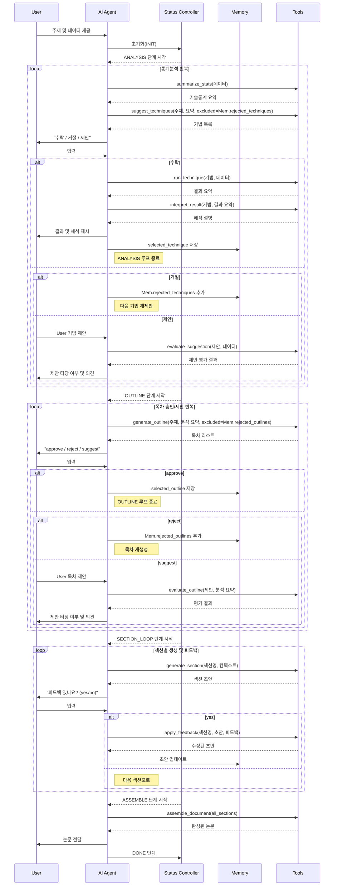

# 구조

## Initialize

---

> 사용자가 논문의 주제와 (또는)데이터를 제공하는 단계입니다.

### Agent

- RequirementsAgent
  - 주제, 목표, 제약조건을 사용자와 대화하며 명확하게 정의하는 에이전트.

### Task

- 주제의 범위·목표·제약조건을 검증하여 요구사항을 명확히 합니다.
- 제공된 데이터 형식(엑셀, CSV, 텍스트 등)과 품질(결측치, 이상치 여부)을 파악합니다.

- 내부 메모리와 상태를 초기화하고, 이후 단계 진행을 위한 준비를 완료합니다.

## Analysis

---

> 사용자가 제공한 주제 및 데이터를 분석하는 단계입니다.

- 주제 및 데이터를 토대로 사용 가능한 통계·분석 기법을 검토합니다.
- 사용자에게 통계 기법을 제안합니다. “수락/거절/재제안” 방식으로 피드백을 반영합니다.
  - 반려 시, 다른 통계 기법을 제안합니다.
  - 사용자가 다른 통계 기법을 제안한다면, 타당성 검토를 진행합니다.
    - 타당하지 않아도 원하는 경우, 그대로 진행합니다.
- 최종 선정된 기법으로 데이터 전처리(정제·정규화·피처 엔지니어링)와 분석을 수행합니다.
- 분석 결과를 요약하여, 이후 목차 설계 및 섹션 생성에 활용합니다.

## Outline

---

- (데이터 제공 시) 어떤 데이터·결과를 각 섹션에서 활용할지 명시합니다.
- 목차를 ‘대–중–소’ 구조로 구성하되, 기본 틀은 다음과 같습니다:
  1. **서론**
     - 연구의 필요성 및 목적
     - 연구 방법 및 논문 구성
  2. **이론적 배경**
  3. **(생성)**
  4. **(생성)**
  5. **결론**
  6. **기타**
     - 참고 문헌
     - Abstract
     - 부록 및 기타
- 각 목차 항목별 간단한 설명(Why, How)을 작성합니다.
- 마지막에 주제와 목차, 목차 설명이 잘 이어지는지 검토해야 합니다.
- 사용자에게 목차 및 설명을 검토·승인 또는 반려 후 재수정합니다.

- 추후, 목차마다 어떤 전문 지식을 참고할지 기능을 추가.
  - 전문 지식을 참고했다면, 참고 문헌에 추가.

## Section loop

---

> 계획된 목차와 목차 설명을 주제대로 구체화 하는 단계입니다.

- 승인된 목차 순서대로 각 섹션의 초안을 생성합니다.
- 필요한 경우 전문 지식 문헌·데이터 차트 등을 인용하여 내용을 풍성히 합니다.
- 사용자에게 “피드백(수정·보완)”을 받아 반영하고, 최종 확정된 섹션을 저장합니다.
- 모든 섹션에 대해 순환하며, 사용자 피드백을 통해 완성도를 높입니다.

## Assemble

---

> 구체화된 각 부분의 설명을 하나로 합치는 단계입니다.

- 확정된 각 섹션을 하나의 문서로 통합합니다.
- 전체 문체·용어·스타일의 일관성을 점검합니다.
- 인용·참고문헌 형식, 각주·그림·표 레이아웃을 정리하여 최종 교정합니다.
- 완성된 논문 파일(DOCX 등)로 제공합니다.
